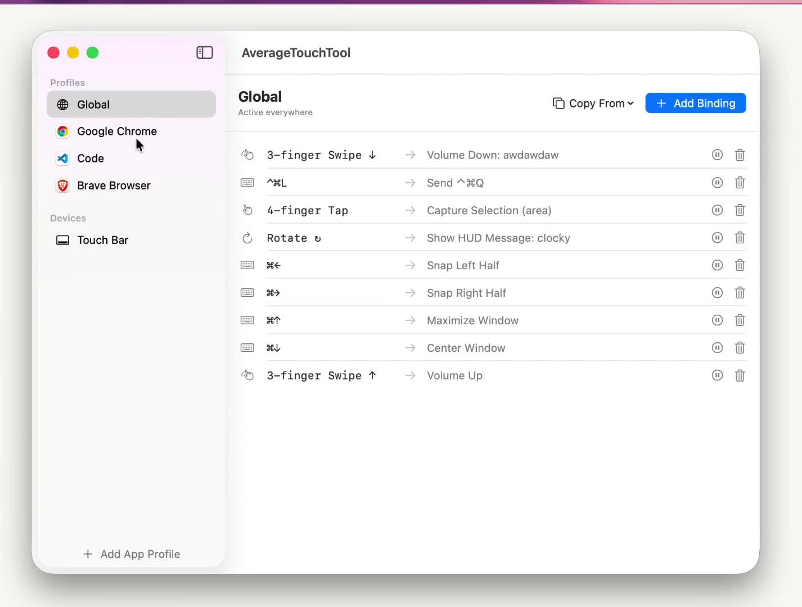
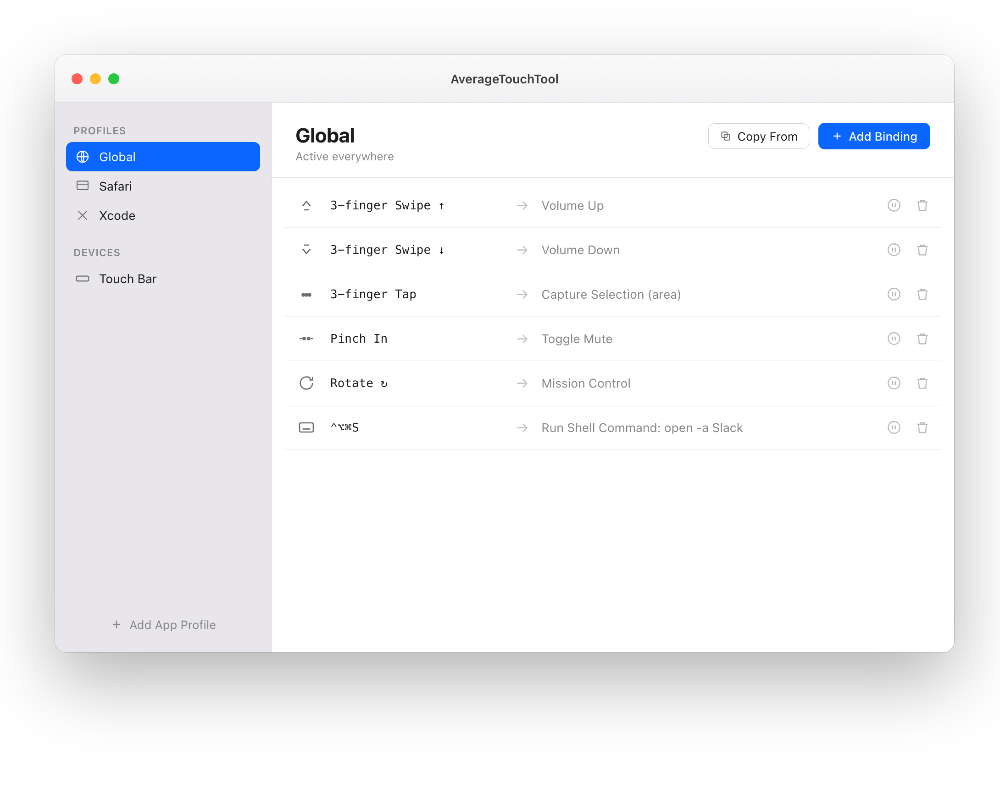
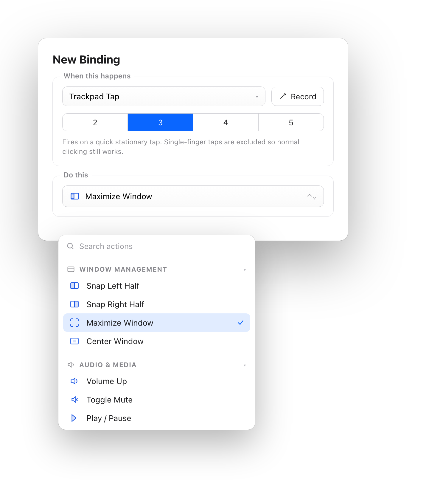

<h1 align="center">AverageTouchTool</h1>

<p align="center">
  Trackpad gestures &amp; custom actions for macOS. Named conservatively.<br>
  A native, open-source menu-bar app — no Electron, no runtime.
</p>

<p align="center">
  <a href="https://github.com/SuharshTyagii/AverageTouchTool/releases/latest/download/AverageTouchTool.dmg"></a>
  <a href="https://github.com/SuharshTyagii/AverageTouchTool/releases"></a>
  
  
</p>

## Demo

<p align="center">
  <a href="https://github.com/SuharshTyagii/AverageTouchTool/raw/main/web/assets/att-demo.mp4">
    
  </a>
  <br><em>▶ Click to watch the demo</em>
</p>

## Screenshots

<p align="center">
  
  
</p>

## Install

**Download the app**

1. Grab the latest [**AverageTouchTool.dmg**](https://github.com/SuharshTyagii/AverageTouchTool/releases/latest/download/AverageTouchTool.dmg) and drag it to **Applications**.
2. First launch: **right-click the app → Open** (it's code-signed but not yet notarized, so Gatekeeper asks once). If macOS still blocks it:
   ```bash
   xattr -dr com.apple.quarantine /Applications/AverageTouchTool.app
   ```
3. Grant **Accessibility** + **Input Monitoring** when prompted (and **Screen Recording** for the capture actions).

**Or build from source** (Swift 6 / macOS 14+, Xcode command-line tools):

```bash
git clone https://github.com/SuharshTyagii/AverageTouchTool.git
cd AverageTouchTool
./package.sh   # builds, signs, installs, and launches
```

## Features

- **Trackpad gestures** — 2–5 finger **taps**, multi-finger **swipes** (↑↓←→), two-finger **pinch** and **rotate**, read from raw multitouch frames for true finger counts.
- **Searchable action library** by category — window snapping (left/right half, maximize, center), media keys, volume / mic, Mission Control, Control Center, lock screen, Night Shift, screenshots, launch app, open URL, run shell / AppleScript, send keyboard shortcut, HUD.
- **Per-app profiles** — bindings can be global or fire only when a chosen app is frontmost.
- **Record a gesture** — hit Record in the editor, perform the gesture, and the trigger fills itself in.
- **Customizable Touch Bar** — one launcher in the Control Strip opens a full-width modal of your buttons and sliders.
- **Import / export** — your whole setup (profiles, bindings, Touch Bar) is a single JSON file.
- Starts empty — you build your own bindings.

## Requirements

macOS 14+ · Apple Silicon &amp; Intel.

## Repo layout

- `Sources/BetterTouch/` — the Swift app (input → engine → actions; Touch Bar subsystem)
- `web/` — the landing page ([averagetouchtool.suharshh.com](https://averagetouchtool.suharshh.com))
- `video/` — the Remotion promo project

---

Built by [Suharsh Tyagi](https://suharshh.com) · MIT licensed
